 

&nbsp;

&nbsp;

---

## About

>  **A note on my stack breadth:** Yes, I work across many technologies — and yes, I know that might look scattered at first glance. But every tool here was learned over years of real projects, not weekend tutorials. I didn't collect them; I *built* with them. Each one has production scars. My current focus is **LLM Systems Engineering**, and everything else feeds into that.

---

## AI & LLM Engineering — *Current Focus*

> This is where I'm investing most of my energy right now. Building production-grade LLM systems, RAG pipelines, and AI-powered business tools.

---

## Full Stack Engineering

### Skill Overview

| Technology | Level | Experience | Projects | AI-Assisted |
|:-----------|:-----:|:-----------|:--------:|:-----------:|
| **.NET** | Expert | Since 2019 — deepest roots, highest confidence | 30+ | 3 |
| **ABP Framework** | Expert | Built a full ERP system end-to-end (Backend) | 1 large ERP | — |
| **Next.js** | Expert | Since 2022, across SaaS, ERP, client work | 20+ | 3 |
| **React** | Expert | Since 2021, core of most web projects | 10+ | 1 |
| **Laravel** | Strong | Production deployments, API-first systems | 2 | 1 |
| **Flutter** | Proficient | Mobile apps, AI-assisted workflow | 3 | 3 |
| **React Native** | Proficient | Cross-platform mobile development | 1 | 1 |

---

## Technical Arsenal

### Frontend

### Backend & Infrastructure

### Databases & Vector Stores

### Mathematics Foundation

### Design & Visual

---

## Featured Projects

| Project | Description | Stack |
|:--------|:------------|:------|
| **RedGerm** | Enterprise Plant Breeding & Trial Management System — from genetic material to variety release | `Laravel` `React` `Inertia.js` `PostgreSQL` |
| **Gold Royal** | Real-time gold price tracker for the Egyptian market — global vs local gap display | `Laravel` `React` `Inertia.js` |
| **Mizan ميزان** | Personal finance & productivity app for Arabic-speaking youth | `React Native` `Expo` `Supabase` |
| **Farhetna فرحتنا** | Digital wedding invitation micro-SaaS — flat-fee, Egyptian market | `Next.js` `Prisma` `Paymob` `Cloudflare R2` |
| **LLM Business Assistant** | Enterprise AI assistant with RAG over internal company data | `Python` `LangChain` `FastAPI` `Pinecone` |
| **ERP System** | Full-scale enterprise resource planning platform | `.NET` `ABP Framework` `Next.js` `PostgreSQL` |
| **AI Sales Evaluation Engine** | Automated sales rep evaluation powered by LLMs | `FastAPI` `LangChain` `PostgreSQL` |

---

## GitHub Statistics

---

## 2026 Roadmap

- [ ] Deploy a production-grade LLM system inside a real company
- [ ] Launch first commercial SaaS product to market
- [ ] Integrate AI pipelines into 3+ production systems
- [ ] Publish mobile app to both App Store & Play Store
- [ ] Reach 100 GitHub stars across repositories
- [ ] Build systems actively used by 10+ companies

---

## Contribution Activity

---

## Connect

 

